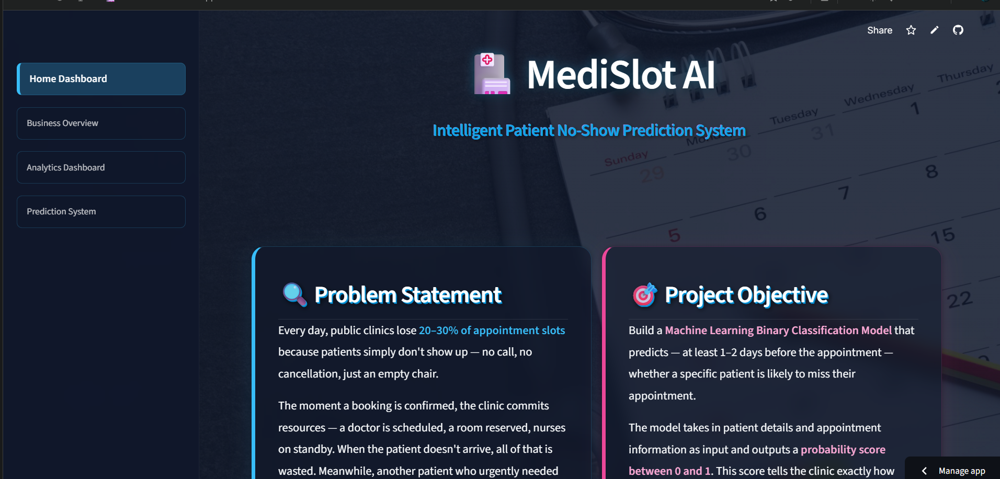
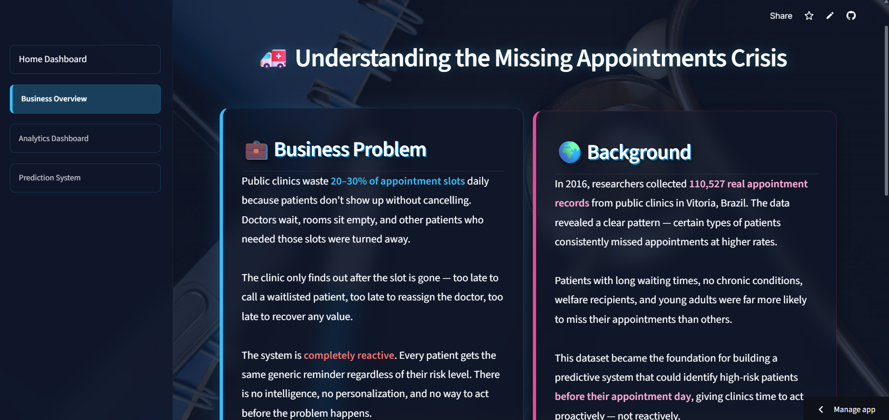
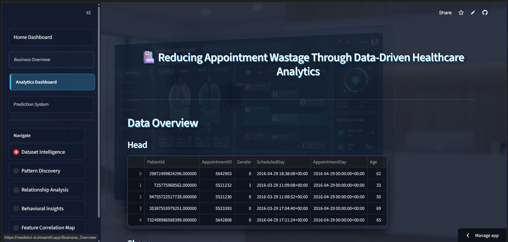
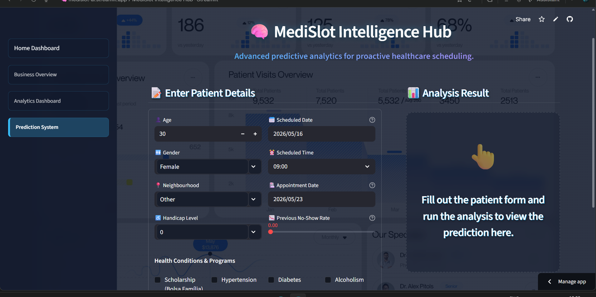

# 🏥 MediSlot AI — Intelligent Patient No-Show Prediction System

> A machine learning-powered healthcare analytics platform that predicts whether a patient is likely to miss their medical appointment — helping clinics shift from reactive scheduling to proactive healthcare management.

---

# 🌐 Live Application

**Deployed Streamlit App:**
[https://medislot-ai.streamlit.app](https://medislot-ai.streamlit.app)

---

# 📌 Problem Statement

Public healthcare systems worldwide lose 20–30% of appointment slots daily because patients fail to attend scheduled consultations without prior cancellation.

When a patient books an appointment, hospitals allocate critical resources:

* Doctor consultation time
* Examination rooms
* Nursing staff
* Administrative scheduling

If the patient does not arrive:

* the appointment slot remains unused,
* clinic productivity decreases,
* healthcare costs increase,
* and another patient who genuinely needed care loses access to treatment.

The existing appointment workflow is completely reactive. Clinics discover a missed appointment only after the slot is already wasted — too late to contact waitlisted patients or recover operational value.

| Region                    | Impact                                    |
| ------------------------- | ----------------------------------------- |
| 🇧🇷 Brazil               | 20–30% no-show rate in public clinics     |
| 🇺🇸 United States        | $150 billion lost annually                |
| 🇬🇧 United Kingdom (NHS) | 1 million appointments wasted every month |
| 🇮🇳 India                | Up to 40% no-show rate in OPD departments |

---

# 🎯 Project Objective

Build a Machine Learning Classification Pipeline capable of predicting — before the appointment day — whether a patient is likely to miss their appointment.

The system generates a probability score between **0 and 1** that helps clinics take proactive action.

| Risk Score  | Label          | Recommended Action                           |
| ----------- | -------------- | -------------------------------------------- |
| > 0.70      | 🔴 High Risk   | Personal phone call + offer slot to waitlist |
| 0.35 – 0.70 | 🟡 Medium Risk | WhatsApp + SMS reminders                     |
| < 0.35      | 🟢 Low Risk    | Standard automated reminder                  |

---

# 🌍 Background

In 2016, researchers collected over **110,527 real appointment records** from public healthcare clinics in Vitória, Brazil.

The dataset revealed clear behavioral patterns:

* patients with long waiting times,
* younger adults,
* welfare recipients,
* and patients with inconsistent medical follow-ups

were significantly more likely to miss appointments.

This project transforms those behavioral insights into a predictive healthcare intelligence system capable of identifying high-risk patients before appointment day.

---

# 📊 Dataset Information

| Property           | Detail                                       |
| ------------------ | -------------------------------------------- |
| Source             | Kaggle — No-Show Appointments                |
| Origin             | Public healthcare clinics in Vitória, Brazil |
| Year               | 2016                                         |
| Total Records      | 110,527 appointments                         |
| Target Column      | `NoShow`                                     |
| Class Distribution | ~79.8% attended, ~20.2% no-show              |

Dataset Link:
[https://www.kaggle.com/datasets/joniarroba/noshowappointments](https://www.kaggle.com/datasets/joniarroba/noshowappointments)

---

# 📋 Original Features

| Column         | Description                       |
| -------------- | --------------------------------- |
| PatientId      | Unique patient identifier         |
| AppointmentID  | Unique appointment identifier     |
| Gender         | Patient gender (M/F)              |
| ScheduledDay   | Booking timestamp                 |
| AppointmentDay | Actual appointment date           |
| Age            | Patient age                       |
| Neighbourhood  | Clinic neighborhood               |
| Scholarship    | Bolsa Familia welfare program     |
| Hypertension   | Hypertension condition flag       |
| Diabetes       | Diabetes condition flag           |
| Alcoholism     | Alcoholism condition flag         |
| Handicap       | Disability severity level         |
| SMS_received   | Whether reminder SMS was received |
| NoShow         | Target variable                   |

---

# ⚙️ Engineered Features

| Feature              | Description                          |
| -------------------- | ------------------------------------ |
| WaitingDays          | Days between booking and appointment |
| ScheduledHour        | Hour when appointment was booked     |
| AppointmentDayOfWeek | Appointment weekday                  |
| PreviousNoShowRate   | Historical missed appointment ratio  |
| AgeGroup             | Categorized age bins                 |
| HasCondition         | Combined chronic condition flag      |

---

# 🔍 Key EDA Insights

### 📈 Waiting Time is the Strongest Predictor

Patients with same-day appointments rarely miss consultations, while long waiting periods drastically increase no-show probability.

### 🔁 Historical Behavior Predicts Future Behavior

Patients with a high `PreviousNoShowRate` are significantly more likely to miss future appointments.

### 📱 SMS Reminder Paradox

Patients who received reminders showed higher no-show rates because high-risk patients were usually scheduled further in advance.

### 🏥 Chronic Patients Attend More Reliably

Patients with hypertension or diabetes demonstrate more consistent attendance due to higher health urgency.

### 👨‍💼 Young Adults Show Highest No-Show Rates

Young adults (18–35) are the most inconsistent group because of busy schedules and lower perceived medical urgency.

### 💰 Socioeconomic Factors Matter

Scholarship patients showed elevated no-show rates, likely due to transportation and accessibility barriers.

### 📅 Friday Appointments Have Higher Miss Rates

End-of-week appointments demonstrated noticeably higher absenteeism.

### ⚖️ Severe Class Imbalance

Dataset imbalance (~80/20) required handling using:

* SMOTE oversampling
* scale_pos_weight
* stratified cross-validation

---

# 🤖 Machine Learning Pipeline

```text
Raw Healthcare Data
        ↓
Data Cleaning
        ↓
Feature Engineering
        ↓
Train/Test Split (80/20)
        ↓
ColumnTransformer
    ├── StandardScaler
    ├── OrdinalEncoder
    └── Passthrough
        ↓
SMOTE Oversampling
        ↓
Feature Selection (SelectKBest)
        ↓
Model Training
        ↓
Stratified 5-Fold Cross Validation
        ↓
GridSearchCV Hyperparameter Tuning
        ↓
Final Evaluation
```

---

# 📊 Model Performance

## Cross Validation Results

| Model               | AUC-ROC | F1 Score | Precision | Recall |
| ------------------- | ------- | -------- | --------- | ------ |
| XGBoost             | 0.7337  | 0.2247   | 0.4506    | 0.1497 |
| Random Forest       | 0.6897  | 0.3261   | 0.3607    | 0.2976 |
| Logistic Regression | 0.6766  | 0.4096   | 0.3148    | 0.5860 |
| Decision Tree       | 0.5526  | 0.3184   | 0.3397    | 0.2997 |

---

# 🏆 Best Model — Tuned XGBoost

| Metric    | Score  |
| --------- | ------ |
| AUC-ROC   | 0.7376 |
| Recall    | 0.8985 |
| Precision | 0.2954 |
| F1 Score  | 0.4447 |
| Accuracy  | 0.5500 |

### Why High Recall Matters

In healthcare scheduling systems:

* a false negative means a missed no-show prediction,
* resulting in a wasted appointment slot,
* denied care for another patient,
* and operational losses.

A false positive only results in an additional reminder or follow-up call.

Therefore, maximizing recall is strategically more valuable than maximizing accuracy.

---

# ⚡ Best Hyperparameters

```python
{
    'learning_rate': 0.1,
    'max_depth': 5,
    'n_estimators': 200,
    'subsample': 1.0,
    'scale_pos_weight': 4
}
```

---

# 📸 Application Screenshots

## 🏠 Home Dashboard





### Features

* Premium healthcare analytics landing page
* Glassmorphism dark UI
* Business-focused AI healthcare branding
* Interactive navigation system

---

## 💼 Business Overview





### Features

* Real-world healthcare scheduling problem explanation
* Operational impact visualization
* Business-focused AI solution framing
* Healthcare workflow insights

---

## 📊 Analytics Dashboard





### Features

* Dataset intelligence dashboard
* Pattern discovery visualizations
* Relationship analysis charts
* Behavioral insights exploration
* Feature correlation analysis

---

## ⚡ Prediction System





### Features

* Real-time patient risk prediction
* Interactive healthcare input system
* AI-powered no-show probability scoring
* Risk-based healthcare recommendations
* High-risk patient identification

---

# 🖥️ Application Features

## 🏠 Home Dashboard

* Healthcare analytics landing page
* Business-focused project overview
* Interactive dashboard UI

## 💼 Business Overview

* Real-world healthcare scheduling problem
* Operational and financial impact
* Business-driven AI solution framing

## 📊 Analytics Dashboard

* Dataset intelligence
* Pattern discovery
* Relationship analysis
* Behavioral insights
* Feature correlation visualization

## ⚡ Prediction System

* Interactive patient risk prediction
* Real-time probability scoring
* Risk-based recommendations
* High-risk patient identification

---

# 🛠️ Tech Stack

| Category             | Technologies              |
| -------------------- | ------------------------- |
| Programming Language | Python 3.10               |
| Data Processing      | Pandas, NumPy             |
| Data Visualization   | Matplotlib, Seaborn       |
| Machine Learning     | Scikit-learn, XGBoost     |
| Imbalance Handling   | Imbalanced-learn (SMOTE)  |
| Web Framework        | Streamlit                 |
| Model Serialization  | Joblib                    |
| Version Control      | Git & GitHub              |
| Deployment           | Streamlit Community Cloud |

---

# 📁 Project Structure

```text
medislot-ai/
│
├── assets/
│   ├── images/
│   │   ├── appointments.jpeg
│   │   ├── calendar.jpeg
│   │   ├── healthcare_bg.jpeg
│   │   └── medical_dashboard.jpeg
│   │
│   └── style.css
│
├── pages/
│   ├── 01_Business_Overview.py
│   ├── 02_Analytics_Dashboard.py
│   └── 03_Prediction_System.py
│
├── utils/
│   └── ui.py
│
├── app.py
├── train_model.py
├── medical_appointment.csv
├── insights.json
├── model_metrics.json
├── noshow_model.pkl
├── requirements.txt
└── README.md
```

---

# 🚀 Installation & Setup

## 1️⃣ Clone Repository

```bash
git clone https://github.com/yourusername/medislot-ai.git
cd medislot-ai
```

---

## 2️⃣ Create Virtual Environment

### Windows

```bash
python -m venv venv
venv\Scripts\activate
```

### Mac/Linux

```bash
python3 -m venv venv
source venv/bin/activate
```

---

## 3️⃣ Install Dependencies

```bash
pip install -r requirements.txt
```

---

## 4️⃣ Train the Model

```bash
python train_model.py
```

This generates:

* `noshow_model.pkl`
* `model_metrics.json`

---

## 5️⃣ Run Streamlit Application

```bash
streamlit run app.py
```

---

# 📦 Requirements

```text
streamlit
pandas
numpy
matplotlib
seaborn
scikit-learn
xgboost
imbalanced-learn
joblib
```

---

# 📈 Business Impact Estimation

Assuming:

* 500 weekly appointments
* 20% no-show rate
* 90% recall model

The system can identify approximately:

* 90 high-risk patients weekly

If even 40% of flagged patients attend after reminders:

* ~36 additional patients receive care every week

Estimated operational recovery:

* ₹10,800 per week
* ₹5,61,600 annually

without requiring additional hospital infrastructure.

---

# 🔮 Future Enhancements

## Planned Recommendation Engine

| Layer           | Trigger                    | Planned Action                 |
| --------------- | -------------------------- | ------------------------------ |
| 🔴 Risk-based   | Score > 0.70               | Personal phone call            |
| 🏥 Medical flag | Chronic condition detected | Priority follow-up reminders   |
| ⏳ Wait flag     | WaitingDays > 30           | Multi-stage reminders          |
| 🔁 Repeat flag  | High previous no-show rate | Chronic no-show monitoring     |
| 💰 Welfare flag | Scholarship = 1            | Transport assistance reminders |
| 👴 Senior flag  | Age > 60                   | Caregiver notification         |
| 👶 Minor flag   | Age < 18                   | Parent reminder system         |

---

## Additional Future Scope

* FastAPI real-time prediction API
* Weather-based attendance prediction
* Geographic distance analysis
* EHR integration
* Model drift monitoring
* Real-time analytics dashboard
* Automated appointment optimization

---

# 👨‍💻 Author

Built as an end-to-end Machine Learning portfolio project demonstrating:

* healthcare analytics,
* predictive modeling,
* feature engineering,
* model deployment,
* and interactive dashboard development.

---

# ⭐ Key Skills Demonstrated

* Machine Learning
* XGBoost
* Feature Engineering
* EDA & Data Visualization
* Healthcare Analytics
* SMOTE & Imbalanced Learning
* Hyperparameter Tuning
* Streamlit Deployment
* Git & GitHub
* End-to-End ML Pipeline
